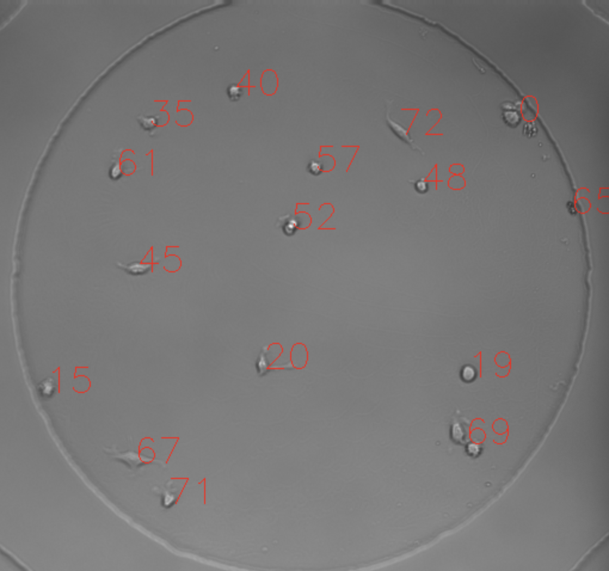

html>
<head>
<title> CS585 Homework Template: HW[x] Student Name [xxx]  </title>

</head>

<body>

<h1>Assignment 5</h1>

 
 CS 585 HW 5  
 Jiatong Yin  
Yutong Wang  
 Boyi Song  
    2021/4/9 

<h2> Problem Definition </h2>

Current problem is to track multiple objects in video, and our input is frame images of bats and cells: 

We directly used the detection results and segmentation results of bats, and do detection and segmentation of cells on our own code

We made assumption that the nearest points between 2 sequential frames is very likely to be the same objects. So we apply GNNSF in data association

To run the tracker: python Tracker.py --frames [your_image_path]

To run the test_greedy: python test_greedy.py --frames [your_image_path]

<h2> Method and Implementation </h2>

1. Do detection and segmentation on bats and cells frames

To do this, we first calculate the average frame and use it to remove noise and background influence. Then we apply cv2.connectedComponentsWithStats to get 
features of segmented objects, among which we care centroid most.

2. Design greedy matching algorithm to do data association

To do this, we basically find all the nearest location pairs between 2 sequential frames, but we add a check: if the shortest distance is too far(eg, 100px), we don't regard it as a valid match and do next match computation.

We also tried simple greedy matching algorithm, which doesn't have a check. Unfortunately, the result is not satisfying

3. Use alpha/beta filter to predict next position(centroid) and velocity

We set alpha = beta = 1 to start and call greedy matching algorithm to do matching tasks. However, the matching pairs may not include all the objects since we put a check before matching. Those locations that are not matched will still be given an id but wait for future matching.

class: State: to store the object's centroid

class: Uncertain: to keep object locations that are not sure if they are spurious detections

class: helper: to implement some functions to calculate distances, draw dots on image and so on.

function: preprocess_data() to get the list of image frames and centroid of bats and cells

function: mainComputation() and my_motion_energy() to display the movements

class: DataAssociation: implement the greedy matching algorithm and store temporary unmatched object locations

class: ABFilter: init the alpha/beta filter and try to predict next frame locations and velocity.

<h2> Results</h2>

<table>
<tr><td colspan=3>
<h3>Results</h3>
</td></tr>
<tr>
</tr>
<tr>
  <td> test simple greedy algorithm</td> 
  <td>  </td> 
</tr> 
<tr>
  <td> tracking bats</td> 
  <td> <video width="250" height="350" controls autoplay>
  <source src="bat_track1.mp4" type="video/mp4"> </td> 
</tr> 

<tr>
  <td>bats trajectories</td> 
  <td> <video width="250" height="350" controls autoplay>
  <source src="bat_track2.mp4" type="video/mp4"> </td> 
</tr> 

<tr>
  <td>tracking cells</td> 
  <td> <video width="250" height="350" controls autoplay>
  <source src="cell_track2.mp4" type="video/mp4"> </td> 
</tr> 

<tr>
  <td>cells trajectories</td> 
  <td> <video width="250" height="350" controls autoplay>
  <source src="cell_track1.mp4" type="video/mp4"> </td> 
</tr> 

</table>

<h2> Discussion </h2>

<ul>
<li>Since we consider both location and velocity using alpha/beta filter, we can identify when objects occlude or touch each other. But we may not capture objects that disappear in a frame but appear later in frames. Another fail is on the lower right of bat video, There are so many small and blured bats, which are hard to detect and track.</li>
<li>For new objects arise in a new frame. We first do the greedy matching normally then if there are some positions left in the new frame after matching, we give them a object id and start tracking.   
For objects that leave the field of view, we simply do the greedy matching. If the number of objects in current frame is fewer than previous frame, then after matching we regard objects that are not matched in previous frames as leaving points.</li>
<li>If objects occlude each other, in normal cases. We use uncertain point hash to store these points. They may fly away in future. So we can match them in later 5 frames. But if they still occlude, we may think it as a dead point.  
</li>
<li>
We keep each left locations for next 5 frames, if none of objects in next 5 frames matchs the locations, then we regard those locations are spurious detection.
</li> 
<li>Only considering the distances between objects is feasible but may not be very accurate, since sometimes objects may occlude or be very close to each other. Use velocity will add a parameter to help increase the accuracy of matching.</li>
</ul>

<h2> Conclusions </h2>

Simple greedy matching algorithm is efficient but lacks for accuracy. That's why we need to check the validity of matching results. If the nearest locations is over some threshold, we should not regard them as valid pairs. And we think about some possible cases to improve our model. Alsp, use Kalman with hungarian may get a more accurate result for bat dataset, we tried that but we don't have enough time to improve that. Finally we use alpha/beta filter on both dataset.

We can improve the tracking by using multiple hypothesis with more than two frames, which can strengthen the data association between frames ans also help to solve the oclude case.

<h2> Credits and Bibliography </h2>

openCV::connectedComponentWithStats: https://docs.opencv.org/3.4.2/d3/dc0/group__imgproc__shape.html#ga107a78bf7cd25dec05fb4dfc5c9e765f

Cooperate with Boyi Song, Jiatong Yin.

</body>

</html>
